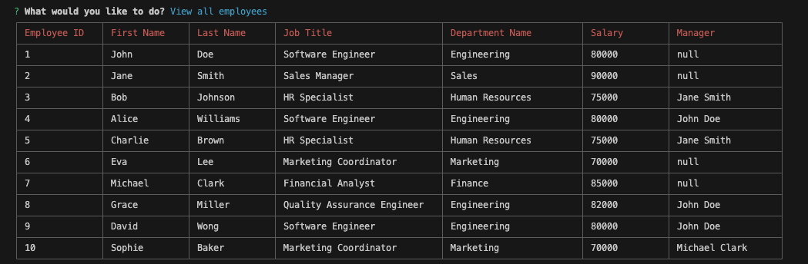
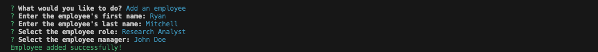
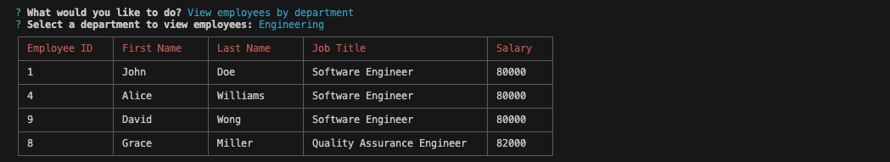

# SQL Employee Tracker

[](https://opensource.org/licenses/MIT)

## Description
The SQL Employee Tracker is a command-line application designed to assist business owners in efficiently managing their company's employee database. This project leverages [Node.js](https://nodejs.org/en), [Inquirer](https://www.npmjs.com/package/inquirer/v/8.2.4), and [MySQL](https://www.mysql.com/) to provide a user-friendly interface for viewing, organizing, and planning business resources. The primary goal of this application is to simplify the management of departments, roles, and employees within a company. By utilizing a command-line interface, the tool enables business owners to perform essential tasks related to their workforce, enhancing organizational efficiency

## Table of Contents
- [Features](#features)
- [Installation](#installation)
- [Usage](#usage)
- [License](#license)
- [Contributing](#contributing)
- [Questions](#questions)

## Features
- <strong>Viewing Data:</strong> 
  - View all departments, roles, and employees for a comprehensive organizational overview. 
  - View employees by manager, view employees by department, and view the total utilized budget of a department by aggregating employee salaries.
- <strong>Adding Data:</strong> 
  - Add new departments, roles, and employees seamlessly to keep the database up-to-date.
- <strong>Updating Data:</strong> 
  - Modify employee roles to reflect accurate responsibilities. 
  - Modify employee manager assignments to accurately represent reporting structures.
- <strong>Deleting Data:</strong> 
  - Delete departments, roles, and employees for efficient database management.

## Installation
To install the SQL Employee Tracker, follow these steps:

1. Clone the repository to your local machine.
    ```bash
    git clone https://github.com/kyoriku/sql-employee-tracker.git
    ```
2. Navigate to the project directory.
    ```bash
    cd sql-employee-tracker
    ```
3. Ensure you have a local MySQL database set up. You can use either [MySQL Workbench](https://www.mysql.com/products/workbench/) or [MySQL Shell](https://dev.mysql.com/doc/mysql-shell/8.0/en/mysql-shell-getting-started.html) to create the necessary database. If you haven't set up the database yet, follow these steps:
    - Open MySQL Workbench or use the MySQL Shell.
    - Create a new database, e.g., employee_tracker_db.
    - Run the SQL scripts provided in the projects `db` directory to set up the necessary tables and seed the initial data.
4. Install the required dependencies.
    ```bash
    npm install
    ```

## Usage
To use the SQL Employee Tracker, follow these steps:

1. Navigate to the project directory.
    ```bash
    cd sql-employee-tracker
    ```
2. Start the application.
    ```bash
    npm start
    ```
3. Follow the on-screen prompts to manage departments, roles, and employees.

### Demo Video

https://github.com/kyoriku/sql-employee-tracker/assets/145511725/b25421ca-3f93-4199-bae7-7fd5ca5d3f14

[Link to demo video](https://drive.google.com/file/d/1Rb1I1Fru8UOsFLFaA8BcbwsxXUqTfHHE/view?usp=drive_link)

### Screenshots











## License
This application is covered by the [MIT](https://opensource.org/licenses/MIT) license.

## Contributing
If you want to contribute to this project, follow these steps:

1. Fork the repository.
2. Create a new branch for your feature or bug fix.
3. Make your changes and commit them with descriptive commit messages.
4. Push your changes to your branch.
5. Submit a pull request, explaining your changes.

## Questions
If you have any questions, please contact [kyoriku](https://github.com/kyoriku) or email devkyoriku@gmail.com.
